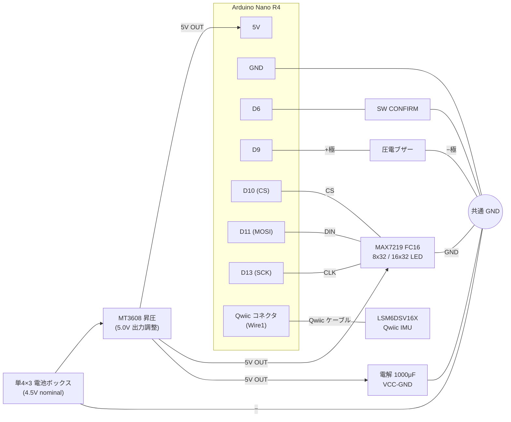

# led-tilt-games

Arduino Nano R4 + MAX7219 LED マトリクス + 6 軸 IMU で動く手のひらゲーム機。
**本体を傾けて遊ぶ** 3 本のミニゲームを 1 つの基板に収めた個人プロジェクト。

- ハード: Arduino Nano R4 / MAX7219 FC16 (8×32 または 16×32) / LSM6DSV16X (Qwiic)
- 操作: ジャイロ傾きで移動・選択、決定ボタン 1 個
- 表示: 標準 **8×32 LED**（FC16 4 枚）、`config.h` の `MATRIX_EXT` 有効化で **16×32**（FC16 8 枚）
- 1 ソースで 8×32 / 16×32 を両対応

## 収録ゲーム

| ゲーム | モード | 内容 |
|--------|--------|------|
| 鬼ごっこ (TAG) | EASY / NORM / HARD | プレイヤー（回転ハロー）が NPC（点滅ドット）を 30 秒間で何人捕まえられるか。HARD は BFS 最適逃走 |
| 砂あそび (SAND) | PLAY / KEEP / TIME | 粒子物理で砂が流れる。PLAY=自由遊び / KEEP=端落ちで消滅、残量を競う（振ると補充）/ TIME=振る・壁衝突で増殖、画面を埋めるタイムアタック |
| 落下よけ (DODGE) | EASY / HARD | 縦持ち、左右に傾けて降ってくる障害物を避ける。徐々にスピードアップ |

起動アニメーションで「LED GAMES」のロゴ演出が走ったあと、メニュー画面に入る。

## 必要部品

| 部品 | 型番 / 仕様 | 用途 |
|------|------------|------|
| マイコン | Arduino Nano R4 | メイン処理 |
| LED ドライバ | MAX7219 FC16 ×4（8×32）/ ×8（16×32） | LED 駆動 |
| IMU | LSM6DSV16X (Qwiic ブレイクアウト) | 傾き・シェイク・回転検出 |
| ブザー | 圧電パッシブブザー | BGM・SE |
| 昇圧 | MT3608 | 4.5V → 5V 昇圧 |
| 電池 | 単4×3 | 電源 |
| コンデンサ | 電解 1000μF / 10V | MAX7219 ピーク電流対策 |
| ボタン | タクトスイッチ ×1 | 決定 (CONFIRM) |

## 配線

| 信号 | Nano R4 | 備考 |
|------|---------|------|
| BTN_CONFIRM | D6 | INPUT_PULLUP、唯一のボタン |
| MAX7219 DIN | D11 | SPI MOSI |
| MAX7219 CLK | D13 | SPI SCK |
| MAX7219 CS | D10 | SPI CS |
| BUZZER | D9 | `tone()` |
| IMU (LSM6DSV16X) | **Qwiic コネクタ** | Qwiic ケーブル 1 本。バスは **Wire1** |



ボタンは `INPUT_PULLUP` で、片側を D6、もう片側を GND に接続（外付けプルアップ不要）。
IMU は Qwiic ケーブル 1 本で Nano R4 の Qwiic コネクタへ繋ぐだけ（3.3V・SDA・SCL・GND がケーブルに含まれる）。

> **注意**: MT3608 出力は通電前にテスタで **5.0V ± 0.1V** に調整してから Nano R4 の 5V ピンへ接続する。USB-C と電池を同時接続する場合は電源経路が競合する恐れがあるため、片方のみで運用する。MAX7219 直近に **1000μF 電解コンデンサ** を VCC-GND 間に置きピーク電流を補強する。16×32 構成は消費電流が増えるため、USB だけでなく余裕のある 5V 電源での給電を推奨。

## ビルド方法

### ボードパッケージ

Arduino IDE の Tools > Board > Boards Manager で **「Arduino UNO R4 Boards」** (v1.5.0 以降) を検索・インストール。Tools > Board > Arduino Renesas UNO R4 Boards > **Arduino Nano R4** を選択。

### 必要ライブラリ

Arduino IDE の Tools > Manage Libraries... から以下をインストール:

- `MD_MAX72XX` (majicDesigns) — LED マトリクス制御

IMU (LSM6DSV16X) は**ライブラリを使わない**（`gyro.cpp` が Wire1 で生 I2C 実装）。SparkFun ライブラリは Nano R4 の Wire1 で正しく動かないため、本プロジェクトは独自実装。

### arduino-cli からビルド

```bash
arduino-cli compile -b arduino:renesas_uno:nanor4 .
arduino-cli upload  -b arduino:renesas_uno:nanor4 -p COM5 .
```

### 8×32 / 16×32 の切り替え

`config.h` の `MATRIX_EXT` で構成を切り替える:

- `// #define MATRIX_EXT`（コメント）→ **8×32**（FC16 4 枚、`MAX_DEVICES=4`）
- `#define MATRIX_EXT`（有効）→ **16×32**（FC16 8 枚、`MAX_DEVICES=8`）

ゲーム・メニュー・各画面はすべて `DISP_ROWS` 駆動で書かれており、1 ソースで両構成に対応する。

## 遊び方

起動アニメ後、メニューが表示される。**メニュー操作もゲーム操作もすべて本体を傾けるジャイロ操作**、決定のみ CONFIRM ボタン。

**メニュー:**
- 本体を**前後に傾ける**: ゲーム切替（鬼ごっこ / 砂あそび / 落下よけ）
- 本体を**左右に傾ける**: モード切替
- **CONFIRM 押下**: 選択中のゲーム・モードを開始
- 左にゲームアイコン + モードインジケーター、右に選択中ゲームのデモアニメ。遷移時に SE、メニュー BGM がループ再生

**ゲーム中:**
- 本体を傾けた方向にキャラクタが移動
- **CONFIRM**: 砂あそび PLAY モード終了、ゲームオーバー画面からメニューへ即時復帰
- 落下よけは**縦持ち**。メニューで選ぶと誘導画面が出て、**本体を 90° 回したのを検知して開始**（CONFIRM でも開始可）

ゲームごとに BGM が異なる（鬼ごっこ・落下よけは別曲、砂あそびは SE のみ）。
ゲームオーバー後は 4 秒で自動的にメニューへ戻る（CONFIRM 押下で即時復帰）。

## ドキュメント

- [ハードウェア仕様書](docs/spec.md) — 部品・配線・ゲーム仕様
- [ソフトウェア仕様書](docs/software_spec.md) — 実装解説（C 言語基礎向け）
- [ジャイロ調整ガイド](docs/gyro_tuning.md) — 傾き・シェイク・回転検知の閾値調整
- [音楽編集ガイド](docs/music_editing.md) — BGM / SE の編集方法と試聴

`music_preview.html` は単体ブラウザツール。`buzzer.cpp` をドラッグ&ドロップすると、収録曲を Web Audio で試聴できる（Arduino 不要、OS 非依存）。

## ライセンス

MIT License — 詳細は [LICENSE](LICENSE) を参照。
