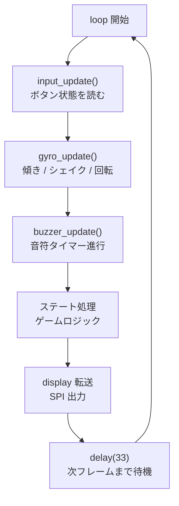
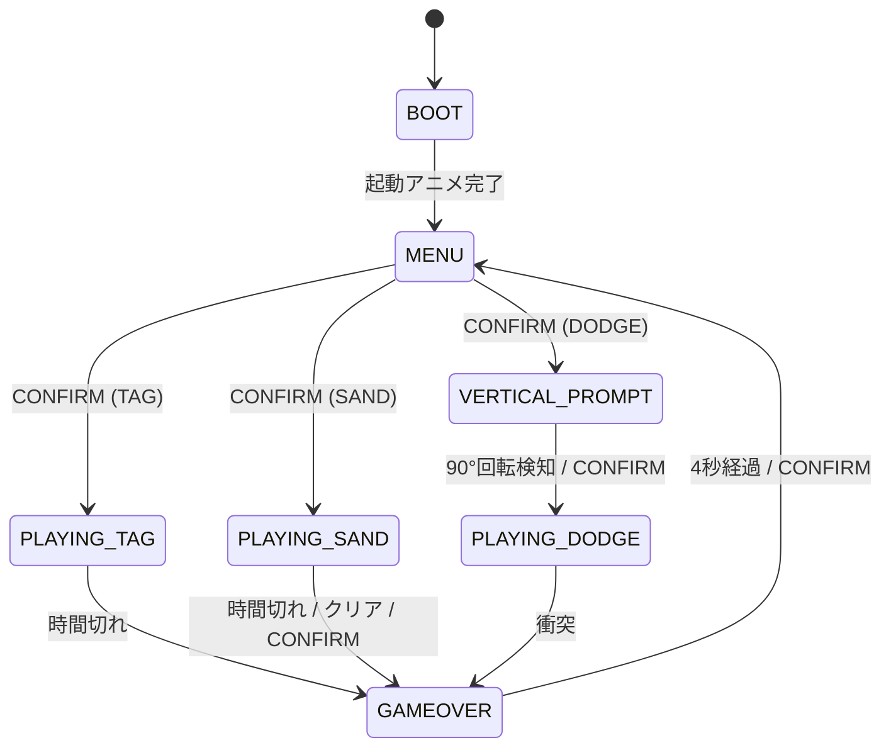

# Arduino ゲーム機 ソフトウェア仕様書

> 対象読者: C言語基礎知識あり、Arduino・組み込み開発初学者

---

## 目次

1. [全体アーキテクチャ](#全体アーキテクチャ)
2. [フレームループの考え方](#フレームループの考え方)
3. [display モジュール](#display-モジュール)
4. [input モジュール](#input-モジュール)
5. [buzzer モジュール](#buzzer-モジュール)
6. [game_tag モジュール](#game_tag-モジュール)
7. [メインループ・ステートマシン](#メインループステートマシン)
8. [その他のモジュール](#その他のモジュール)
9. [メモリ使用量まとめ](#メモリ使用量まとめ)

---

## 全体アーキテクチャ

```
led-tilt-games.ino        ← メインループ・ステートマシン
├── config.h              ← コンパイル時設定 (MATRIX_EXT、ジャイロ閾値)
├── display.*             ← LEDマトリクス制御 (h / common / 8x32 / 16x32)
├── input.h/cpp           ← CONFIRM ボタン入力処理
├── gyro.h/cpp            ← LSM6DSV16X 生 I2C。傾き/シェイク/回転検知
├── buzzer.h/cpp          ← BGM/SE再生
├── boot.h/cpp            ← 起動アニメーション
├── menu.*                ← ゲーム選択メニュー (h / 8x32 / 16x32)
├── game_tag.h/cpp        ← 鬼ごっこ
├── game_sand.h/cpp       ← 砂あそび (粒子物理、3 モード)
└── game_dodge.h/cpp      ← 落下よけ (縦持ち)
```

> 本書は基礎となる display / input / buzzer / game_tag / メインループを詳しく解説し、
> その他のモジュール (gyro / boot / menu / game_sand / game_dodge / 16×32 対応) は
> 第 8 章にまとめる。

### モジュール分割の理由

1ファイルに全部書くこともできるが、役割ごとにファイルを分けると:
- どこに何が書いてあるか把握しやすい
- 1つのモジュールを修正しても他に影響が出にくい
- 将来ゲームを追加するとき (砂シミュレーション等) に再利用できる

### `.h` ファイルと `.cpp` ファイルの役割

| ファイル | 役割 | 例 |
|---------|------|-----|
| `.h` (ヘッダー) | 「何ができるか」の宣言 | 関数名・引数の型・定数 |
| `.cpp` (実装) | 「どうやるか」の実装 | 実際の処理コード |

他のファイルから使うときは `#include "display.h"` とヘッダーだけをインクルードする。
実装の詳細を知らなくても使えるようにするための仕組み。

---

## フレームループの考え方

### ゲームは「コマ送り」で動く

映画が1秒24コマで動くように、このゲームも **1秒30回** (30FPS) の周期でループを回す。
1コマ = 約33ms。



### なぜ `delay(33)` で待つのか

処理が速すぎると1秒間に何百回もループが回り、ボタンが誤検知されたり
音符の長さが狂ったりする。ゲーム速度を一定にするために意図的に待つ。

> **補足**: プロの組み込み開発では `millis()` で経過時間を見て待つ方法 (非ブロッキング) が
> 使われるが、このゲームは処理が軽いため `delay()` で十分。

---

## display モジュール

### 役割

LEDマトリクスを制御する。標準は 8 行×32 列 = 256 個 (MAX7219 4 個)、
`config.h` の `MATRIX_EXT` 有効時は 16 行×32 列 = 512 個 (MAX7219 8 個)。
行数は `DISP_ROWS` (8 または 16) で表され、各ゲーム・各画面もこの値で書かれている。
MAX7219 はデイジーチェーン接続され、SPI通信で命令を送る。
物理転送は `display_8x32.cpp` / `display_16x32.cpp` に分かれ、論理座標の管理・
向き・フォント等の共通処理は `display_common.cpp` が担う。

### フレームバッファとは

```cpp
static bool fb[DISP_ROWS][DISP_COLS]; // fb[row][col]
```

「これから画面に表示したい状態」を一時保存しておく配列。

**なぜ直接LEDを制御しないのか?**

仮に直接制御すると、「NPCを描く」→「プレイヤーを描く」の途中で
画面が更新されて一瞬おかしな表示になる (ちらつき) 。
フレームバッファに全部書き終えてから `display_update()` で一括転送することで
ちらつきを防ぐ。これを **ダブルバッファリング** という考え方に近い手法と呼ぶ。

```
ゲームロジック側:        display モジュール側:
                          
display_clear()           fb を全部 false にリセット
display_set(nx,ny,true)   fb[ny][nx] = true  ← NPCの位置
display_set(px,py,true)   fb[py][px] = true  ← プレイヤーの位置
display_update()          fb の内容を MAX7219 へ一括送信
```

### X軸ミラー補正

FC16タイプのモジュールはハードウェアの都合で **X軸が左右反転** している。
`display_set(0, 0, true)` で左上を点灯したいのに、実際には右上が点灯してしまう。

これを補正するため、`display_update()` で転送するときに列アドレスを反転する:

```cpp
void display_update() {
    for (uint8_t r = 0; r < DISP_ROWS; r++) {
        for (uint8_t c = 0; c < DISP_COLS; c++) {
            // c=0 → DISP_COLS-1=31 へ転送 (左右反転)
            mx.setPoint(r, DISP_COLS - 1 - c, fb[r][c]);
        }
    }
}
```

ゲームロジック側は補正を意識せず、普通に左上(0,0)〜右下(31,7)で考えればよい。

### 3×5ピクセルフォント

数字0〜9を3列×5行のLEDで表示するための定義。
PROGMEM 修飾子でフラッシュメモリ (プログラム領域) に格納する。

> **PROGMEM とは?**  
> Arduino のSRAMは2KB〜32KB程度と少ない。
> 定数データをそのままグローバル変数にするとSRAMを消費してしまう。
> `PROGMEM` をつけると変数をフラッシュメモリ (32〜256KB) に置ける。
> 読み出しには専用関数 `pgm_read_byte()` が必要。

```cpp
static const uint8_t FONT3x5[][3] PROGMEM = {
    {0b11111, 0b10001, 0b11111}, // 0
    {0b00000, 0b11111, 0b00000}, // 1
    // ... 以下略
};
```

各エントリは3バイト = 3列分のデータ。
各バイトのビット配置:

```
バイト値 0b11111 の場合:

bit0(LSB) = row0 (上端) → 1 = 点灯
bit1      = row1        → 1 = 点灯
bit2      = row2        → 1 = 点灯
bit3      = row3        → 1 = 点灯
bit4      = row4 (下端) → 1 = 点灯

つまり 0b11111 = 縦5ピクセルすべて点灯 = 縦棒
```

数字「0」の見た目:
```
列0(0b11111)  列1(0b10001)  列2(0b11111)
■             ■             ■
■             ○             ■
■             ○             ■
■             ○             ■
■             ■             ■
```

描画関数:
```cpp
void display_draw_digit(uint8_t col, uint8_t row, uint8_t digit) {
    for (uint8_t ci = 0; ci < 3; ci++) {           // 3列ループ
        uint8_t coldata = pgm_read_byte(&FONT3x5[digit][ci]);
        for (uint8_t ri = 0; ri < 5; ri++) {        // 5行ループ
            display_set(col + ci, row + ri, (coldata >> ri) & 1);
        }
    }
}
// 使い方: display_draw_digit(8, 2, 5) → col8, row2を起点に数字"5"を描画
```

### タイマーゲージ

col 31 (最右列) をタイマー専用列として使う。
残り時間に応じて上から何個点灯するかを計算:

```cpp
void display_set_timer_gauge(uint8_t filled) {
    for (uint8_t r = 0; r < DISP_ROWS; r++) {
        fb[r][DISP_COLS - 1] = (r < filled); // r < filled なら点灯
    }
}
// filled=8 → 全点灯 (残り時間MAX)
// filled=4 → 上半分点灯 (残り時間50%)
// filled=0 → 全消灯 (タイムアップ)
```

---

## input モジュール

### ボタン割り当て

```
BTN_CONFIRM → D6 ピン (唯一のボタン)

INPUT_PULLUP (押下でLOW、離してHIGH)
```

移動・選択操作はすべて**ジャイロ傾き**で行う。ボタンは決定のみで、ゲームオーバーから
メニューへの即時復帰と砂 PLAY モードの終了にも兼用する。

> **INPUT_PULLUP とは?**  
> ボタンを押していないとき、ピンの電圧が不定 (フローティング) になって
> 誤検知する問題を防ぐために、内部プルアップ抵抗でHIGHに引き上げる設定。
> 外付け抵抗が不要になる。
> ボタン押下時は GND に接続されて LOW になる → 論理が反転する点に注意。

```cpp
bool raw = (digitalRead(PIN[i]) == LOW); // LOW のとき「押している」
```

### チャタリングとデバウンス

機械式スイッチは接点が物理的に「バウンス」して、
押した瞬間に HIGH/LOW が数ms間高速で切り替わる現象 (チャタリング) が起きる。

```
実際の信号:
押す    ____/‾\__/‾‾‾‾‾‾‾‾‾‾‾‾
              ↑↑
         チャタリング (数ms間の高速変化)
```

これを放置すると「1回押したのに3回押した」と認識されてしまう。

**デバウンス処理**: 2フレーム (約66ms) 連続でLOWを確認してから「押した」と確定する:

```cpp
#define DEBOUNCE_FRAMES 2

if (raw) {
    if (db[i] < DEBOUNCE_FRAMES) db[i]++; // カウントアップ
} else {
    db[i] = 0; // 離したらリセット
}
cur[i] = (db[i] >= DEBOUNCE_FRAMES); // 2フレーム連続でLOWなら確定
```

### エッジ検出のみ (オートリピートなし)

ボタンは CONFIRM 1 個のみで、連打する用途がない (決定・終了のみ)。  
`input_pressed()` は立ち下がりエッジ (離す→押す) を 1 回だけ返す。

```cpp
bool input_pressed(Button b) {
    // エッジ検出: 前フレームは離していて今フレームは押している
    return (cur[b] && !prev[b]);
}
```

> **連打禁止の理由**  
> ゲームオーバー画面で CONFIRM を押したままにしても、
> メニュー復帰 → 即ゲーム開始と誤動作しないようにするため。

### ジャイロ入力 (メニュー操作と移動操作)

ボタンが 1 個しかないため、**移動と選択はすべてジャイロで行う**。  
`gyro.h` が `gyro_tilt_x()` / `gyro_tilt_y()` を提供し、戻り値は -1 / 0 / +1 の三値。

```cpp
int8_t tx = gyro_tilt_x(ORIENT_HORIZONTAL); // 左傾き=-1, 中立=0, 右傾き=+1
int8_t ty = gyro_tilt_y(ORIENT_HORIZONTAL); // 前傾=-1, 中立=0, 後傾=+1
```

**メニュー画面**: 中立 → 傾斜への**立ち上がりエッジ**で 1 ステップだけ選択を進める
(長く傾けても 1 回しか進まない)。これによりゲームオーバー復帰直後に筐体が傾いていても
誤選択しない。

---

## buzzer モジュール

### 設計の考え方: ノンブロッキング再生

Arduino 標準の `tone()` は「この周波数で鳴らし続けろ」という命令であり、
「この曲を最後まで鳴らせ」という命令ではない。

素朴な実装:
```cpp
// ダメな例: delay() で待つとゲームが止まる
tone(9, 523); delay(100);
tone(9, 659); delay(100);
tone(9, 784); delay(200);
```

この実装では音を鳴らしている間ゲームが完全に止まってしまう。

**解決策**: 音符リストを作り、時間が来たら次の音符へ進む処理を
`buzzer_update()` として毎フレーム少しずつ実行する (ステートマシン方式) 。

```cpp
// 音符の構造体
struct Note {
    uint16_t freq; // 周波数 Hz (0 = 休符 = 無音)
    uint16_t dur;  // 音の長さ ms
};

void buzzer_update() {
    // まだ今の音符の時間が終わっていなければ何もしない
    if (millis() - note_start_ms < note_dur_ms) return;

    // 時間が来たら次の音符へ進む
    // ... (次の音符を play_note() で再生)
}
```

### BGMとSEの優先制御

SEが鳴っている間はBGMを一時停止し、SE終了後にBGMを再開する:

```
BGM再生中
  ↓ SE_CATCH 発生
SE再生開始 (BGMの再生位置は保持)
  ↓ SE終了
BGMを保持していた位置から再開
```

```cpp
static const Note* bgm_seq = nullptr; // BGM の音符配列へのポインタ
static uint8_t     bgm_idx = 0;       // BGM の現在位置 (何番目の音符か)
static bool        se_active = false; // SE 再生中フラグ

void buzzer_update() {
    if (millis() - note_start_ms < note_dur_ms) return;

    if (se_active && se_seq) {
        se_idx++;
        if (se_idx < se_len) {
            play_note(se_seq, se_idx);     // SE の次の音符へ
        } else {
            se_active = false;
            if (bgm_seq) play_note(bgm_seq, bgm_idx); // BGM 再開
            else noTone(BUZZER_PIN);
        }
    } else if (bgm_seq) {
        bgm_idx = (bgm_idx + 1) % bgm_len; // BGM をループ
        play_note(bgm_seq, bgm_idx);
    }
}
```

### 音楽データ (PROGMEM)

```cpp
// BGM はゲームごとに別配列。鬼ごっこ=BGM_TAG_SEQ、落下よけ=BGM_DODGE_SEQ、
// メニュー=BGM_MENU_SEQ。砂あそびは BGM なし (SE のみ)。
// 注: 全音 392Hz 以上にする。tone() は約366Hz未満で音程がずれるため。
//     編集方法・試聴は docs/music_editing.md を参照。
static const Note BGM_TAG_SEQ[] PROGMEM = {
    {392,230},{494,115},{587,230},{494,115},  // skippy な付点リズムの曲 (一部)
    // ... 以下略
};

// SE: 捕まえた (上昇音)
static const Note SE_CATCH_SEQ[] PROGMEM = {
    {523,  80}, {659,  80}, {784, 120},
};

// SE: スタート (上昇音)
static const Note SE_START_SEQ[] PROGMEM = {
    {523, 100}, {659, 100}, {784, 200},
};
```

---

## game_tag モジュール

### ゲーム仕様

| 項目 | 値 |
|------|-----|
| プレイエリア | 31×DISP_ROWS (col 0〜30、col 31 はゲージ。8行=31×8 / 16行=31×16) |
| 制限時間 | 30秒 |
| 目的 | プレイヤー(点滅)でNPC(点)を追いかけて捕まえる |
| 捕獲条件 | プレイヤーとNPCが同じセルに重なる |
| 捕獲後 | スコア+1、SE再生、NPCを再スポーン |
| 終了条件 | 制限時間切れ |

### 難易度パラメータ

3つのパラメータの組み合わせで難易度を制御する:

```cpp
struct AIParams {
    uint8_t move_every_n; // N フレームに1回だけ NPC が動く (大きいほど遅い)
    uint8_t random_pct;   // ランダム移動する確率 0〜100% (大きいほど迷走する)
    bool    use_bfs;      // true = BFS 最適逃走、false = Chebyshev 近似
};

static const AIParams PARAMS[3] = {
    {3, 40, false}, // EASY: 低速・よく迷走・近似AI
    {2, 15, false}, // NORM: 中速・たまに迷走・近似AI
    {1,  0, true }, // HARD: 全速・迷走なし・最適AI
};
```

### NPC AI の仕組み

#### Chebyshev 距離 (EASY/NORM)

NPC がプレイヤーから最も遠くなる方向を **チェビシェフ距離** で近似して選ぶ。

> **チェビシェフ距離とは?**  
> チェスの「キング」が移動できる最小手数と同じ距離。  
> 縦・横・斜めすべて1手で動けるため、距離 = max(|Δx|, |Δy|)。
>
> 例: (0,0) → (3,5) の距離 = max(3, 5) = 5

```cpp
uint8_t chebyshev(x1, y1, x2, y2) {
    uint8_t dx = (x1 > x2) ? x1 - x2 : x2 - x1; // |x1-x2|
    uint8_t dy = (y1 > y2) ? y1 - y2 : y2 - y1; // |y1-y2|
    return (dx > dy) ? dx : dy;                   // max(dx, dy)
}

// 4方向を試して、プレイヤーから最も遠くなる方向へ移動
for (uint8_t d = 0; d < 4; d++) {
    int8_t cx = nx + DX[d]; // 候補セル
    int8_t cy = ny + DY[d];
    uint8_t val = chebyshev(cx, cy, px, py); // 候補セルからプレイヤーへの距離
    if (val > best_val) { best_val = val; ... }
}
```

この近似は壁に追い詰められると逃げ場を失いやすい欠点がある → EASY/NORM に適切。

#### BFS 距離マップ (HARD)

**幅優先探索 (BFS)** でプレイヤー位置からの正確な移動距離を全セルに計算する。

> **BFS (幅優先探索) とは?**  
> 出発点から近い順にセルを探索していくアルゴリズム。  
> 「プレイヤーから1歩で行けるセル」→「2歩で行けるセル」→... と広がっていく。

```
プレイヤー位置 P=(5,4) のとき:

dist マップ (数字 = プレイヤーからの歩数):
  6 5 4 3 4 5 6 ...
  5 4 3 2 3 4 5 ...
  4 3 2 1 2 3 4 ...
  3 2 1 P 1 2 3 ...
  4 3 2 1 2 3 4 ...
  ...
```

NPC は隣接4セルのうち dist が最大 (= プレイヤーから最も遠い) セルへ移動する。
壁際でも最適な逃走経路を選べるため非常に手強い。

```cpp
static void bfs_from_player() {
    memset(dist, 0xFF, sizeof(dist)); // 全セルを「未到達」(255) で初期化
    uint16_t head = 0, tail = 0;  // 16行版は全セル 496。uint8_t では溢れる
    dist[py][px] = 0;                 // プレイヤー位置の距離 = 0
    qx[tail] = px; qy[tail++] = py;  // キューに追加

    while (head != tail) {            // キューが空になるまで
        uint8_t x = qx[head], y = qy[head++]; // キューから取り出す
        for (uint8_t d = 0; d < 4; d++) {
            int8_t cx = x + DX[d];
            int8_t cy = y + DY[d];
            if (cx < 0 || cx >= PLAY_W || cy < 0 || cy >= PLAY_H) continue; // 範囲外
            if (dist[cy][cx] != 0xFF) continue;   // 既に計算済み
            dist[cy][cx] = dist[y][x] + 1;        // 距離を記録
            qx[tail] = cx; qy[tail++] = cy;        // キューに追加
        }
    }
}
```

**実行コスト**: セル数 31×8=248 個 (16行版は 31×16=496) × 4方向 ≈ 数百μs @48MHz。  
30FPS予算 (33ms) に対してわずか0.6%なので十分余裕がある。

**メモリ使用量**:
```
dist[DISP_ROWS][31]  = 248 (8行) / 496 (16行) バイト
qx[31*DISP_ROWS]     = 同上
qy[31*DISP_ROWS]     = 同上
合計: 約 744 (8行) / 1488 (16行) バイト  (SRAM 32KB に対し最大約4.5%)
```

### NPCスポーン位置

捕獲後のNPCは「プレイヤーから最も遠い4隅」に再出現する:

```
4隅の候補:
(0,0)      (30,0)
           
(0,7)      (30,7)
```

```cpp
void spawn_npc() {
    const uint8_t cx[4] = {0, PLAY_W-1, 0,        PLAY_W-1};
    const uint8_t cy[4] = {0, 0,        PLAY_H-1, PLAY_H-1};
    uint8_t best_corner = 0, best_dist = 0;
    for (uint8_t i = 0; i < 4; i++) {
        uint8_t d = chebyshev(cx[i], cy[i], px, py);
        if (d > best_dist) { best_dist = d; best_corner = i; }
    }
    nx = cx[best_corner];
    ny = cy[best_corner];
}
```

### プレイヤー (鬼) と NPC (逃げる子) の描画差別化

プレイヤーが鬼 (追う側)、NPC が逃げる子。両者を視覚的に区別するため描画を変える。

- **プレイヤー (鬼)**: 中心常時点灯 + 周囲 4 近傍を順繰り点灯する「回転ハロー」。
  迫ってくる迫力を出す。
- **NPC (逃げる子)**: 8Hz の速い点滅ドット。ビクビクして逃げている印象。

```cpp
// NPC: 4f ON / 4f OFF ≈ 8Hz の速い点滅
if ((frame_count / 4) % 2 == 0) {
    display_set(nx, ny, true);
}

// プレイヤー (鬼): 中心常時点灯 + 回転ハロー
display_set(px, py, true);
static const int8_t HDX[4] = { 1, 0, -1, 0 };
static const int8_t HDY[4] = { 0, 1,  0, -1 };
uint8_t phase = (frame_count / 3) % 4;  // 3フレームごとに隣接セルを順繰り点灯
int8_t hx = (int8_t)px + HDX[phase];
int8_t hy = (int8_t)py + HDY[phase];
if (hx >= 0 && hx < PLAY_W && hy >= 0 && hy < PLAY_H) {
    display_set((uint8_t)hx, (uint8_t)hy, true);
}
```

### タイマーゲージ計算

```cpp
// 残り時間をゲージの高さに変換
uint8_t gauge = (uint8_t)((remaining_ms * PLAY_H) / GAME_DURATION_MS);
// remaining_ms = 30000 のとき gauge = 8 (全点灯)
// remaining_ms = 15000 のとき gauge = 4 (半分)
// remaining_ms =     0 のとき gauge = 0 (消灯)
display_set_timer_gauge(gauge);
```

---

## メインループ・ステートマシン

### ステートマシンとは

プログラムが「今どの状態にあるか」を変数で管理し、
状態に応じた処理を実行する設計パターン。



メニューでの選択もジャイロ傾きで行うため、難易度選択は専用ステートを設けずメニューに統合されている。落下よけ (DODGE) は縦持ちのため、開始前に `STATE_VERTICAL_PROMPT` を挟み、回転矢印アニメを表示して 90°回転を検知 (または CONFIRM) でゲームを開始する。

### 各ステートの処理

#### STATE_MENU (メニュー)

```
画面レイアウト (32×8 マトリクス, 8×32 版):

col 0-1  : ページドット (縦 3 個, row 2/4/6) — 選択中は幅 2 ピクセル
col 12-19: ゲームピクトグラム (8×6, row 1-6)
row 7    : モードドット (col 26/28/30) — 選択中は row 6 にも追加
```

- **前後傾き** (gyro_tilt_y): ゲーム切替 (TAG ↔ SAND ↔ DODGE)
- **左右傾き** (gyro_tilt_x): 選択中ゲームのモード切替
- **CONFIRM**: 開始

傾きはエッジ検出 (中立 → 傾斜への立ち上がり) で 1 ステップだけ進める。
傾けっぱなしでも 1 回しか進まないため、ゲーム復帰時に傾いた状態から始まっても暴走しない。

#### STATE_PLAYING (ゲーム中)

`tag_update()` に処理を委譲するだけ。
終了判定は `tag_is_over()` で確認。

#### STATE_GAMEOVER (ゲームオーバー)

スコアを2桁の数字で表示:

```
col: 12 13 14   (空白)   17 18 19
      [十の位]             [一の位]
      row 1〜5 に描画
```

```cpp
display_draw_digit(12, 1, s / 10); // 十の位
display_draw_digit(17, 1, s % 10); // 一の位
```

4秒後または BTN_CONFIRM でメニューに戻る。

---

## その他のモジュール

基礎モジュール以外の概要。詳細は各 `.cpp` のコメントを参照。

### gyro (LSM6DSV16X)

`Wire1` で LSM6DSV16X を**生 I2C**で読む（SparkFun ライブラリは Nano R4 の Wire1
で動かないため不使用）。提供する入力は 3 種:

- **傾き** `gyro_tilt_x/y()` … 加速度から -1 / 0 / +1
- **シェイク** `gyro_shake_consumed()` … 振り検出（砂の補充・増殖に使用）
- **回転** `gyro_rotate_reset/detected()` … ジャイロ Z 軸を積算し約 90°回転を検知
  （落下よけの縦持ち開始に使用）

Nano R4 の Wire1 は I2C トランザクション間で受信値をキャッシュする不具合があり、
毎フレーム `Wire1.end()/begin()` でリセットして回避している。感度の閾値はすべて
`config.h` に集約（調整は `docs/gyro_tuning.md`）。

### boot（起動アニメーション）

電源投入後 3 秒間の演出。`DISP_ROWS` に応じて 8 行 / 16 行で規模が変わる
（16 行版は文字を大きく、粒子を多く）。

### menu（ゲーム選択）

左にゲームアイコン + モードインジケーター、右に選択中ゲームのデモアニメを表示。
砂あそびはモードごとにデモが変わる。前後傾きでゲーム、左右傾きでモードを
エッジ検出で 1 ステップずつ切り替え、CONFIRM で開始。BGM / SE 付き。
8×32 版が `menu_8x32.cpp`、16×32 版が `menu_16x32.cpp`。

### game_sand（砂あそび）

粒子ベースの物理シミュレーション。砂 1 粒ごとに位置（サブピクセル）と速度を持ち、
重力・壁反射・粒子衝突を毎フレーム計算する。3 モード:

- **PLAY** … 自由に傾けて遊ぶ
- **KEEP** … 30 秒。画面端に達した砂は消滅、残った数を競う。振ると補充
- **TIME** … 振る・壁衝突で砂が増殖。画面を埋めるまでのタイムアタック

### game_dodge（落下よけ）

縦持ち専用。上から落ちる障害物を左右移動で避ける。一定時間ごとに加速。
論理座標は縦持ち基準（幅 = `DISP_ROWS`、高さ = 32）。

### 16×32 対応

`config.h` の `MATRIX_EXT` で 8×32 / 16×32 を切り替える。表示行数 `DISP_ROWS`
（8 または 16）を基準に全モジュールが書かれ、物理転送のみ `display_8x32.cpp` /
`display_16x32.cpp` で分岐する。1 ソースで両構成をビルドできる。

---

## メモリ使用量まとめ

| 変数 | サイズ | 場所 |
|------|--------|------|
| `fb[DISP_ROWS][32]` フレームバッファ | 256 B (8行) / 512 B (16行) | SRAM |
| `dist[DISP_ROWS][31]` BFS距離マップ | 248 B / 496 B | SRAM |
| `qx[]`, `qy[]` BFSキュー | 計 496 B / 992 B | SRAM |
| 砂粒子バッファ (game_sand) | DISP_ROWS に比例 | SRAM |
| `FONT3x5` フォントデータ | 数十 B | **フラッシュ** (PROGMEM) |
| BGM/SE 音符データ (全シーケンス) | 数百 B | **フラッシュ** (PROGMEM) |

Arduino Nano R4 のリソース:
- フラッシュ: 256 KB (プログラム + PROGMEM)
- SRAM: 32 KB

実測の使用量 (16×32 ビルド) はフラッシュ約 28%、SRAM 約 40% で十分な余裕がある。

---

*作成日: 2026-04-12* (改訂: 2026-05-23 — 16×32 対応・ゲーム別 BGM・ジャイロ回転検知・メニュー刷新を反映)  
*対象ハードウェア: Arduino Nano R4 + MAX7219 FC16 (8×32 / 16×32) + LSM6DSV16X (Qwiic / Wire1)*
