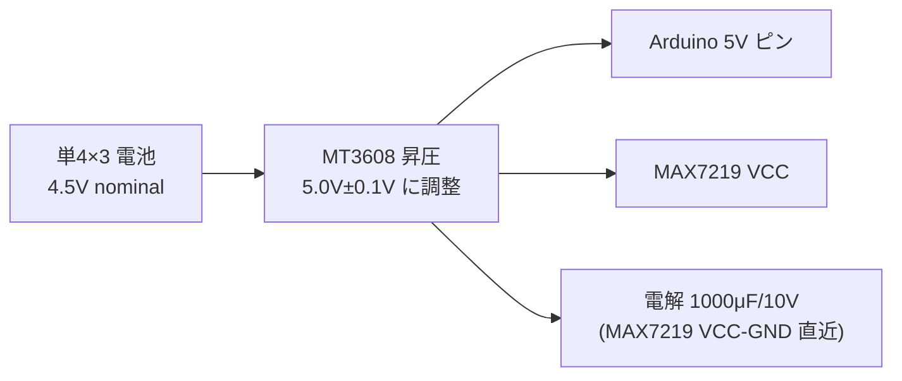
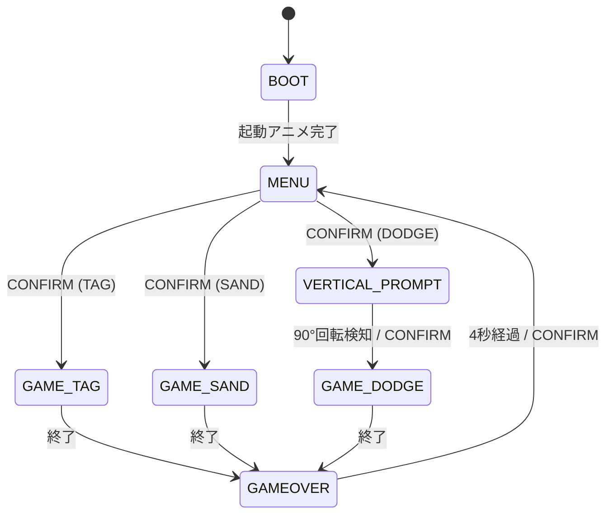

# ジャイロ+LEDマトリクス ゲーム機 仕様書

Arduino Nano R4 で動く手のひら LED ゲーム機 — 傾けて遊ぶ 3 本のミニゲーム入り

---

## 1. コンセプト

筐体一体型の手持ちゲーム機。LEDマトリクスがモニタ、筐体の傾きがコントローラ。
ジャイロセンサーで傾けて遊び、ブザーでBGM/SEを出す。決定だけは 1 個のボタンで行う。

標準は 8×32 LED（FC16 4 枚）。`config.h` の `MATRIX_EXT` で 16×32（FC16 8 枚）にも
ビルドでき、ソースは 1 つで両構成に対応する。

---

## 2. ハードウェア部品一覧

| 部品 | 型番 / 仕様 | 用途 |
|------|------------|------|
| マイコン | Arduino Nano R4 | メイン処理 |
| LEDマトリクスドライバ | MAX7219 ×4（8×32）または ×8（16×32） | LED駆動 |
| ジャイロ+加速度センサー | LSM6DSV16X（Qwiic ブレイクアウト） | 傾き・シェイク・回転検出 |
| ブザー | 圧電パッシブブザー（例 PKM13EPYH4000-A0） | BGM・効果音 |
| 昇圧コンバータ | MT3608 | 電池4.5V→5V |
| 電解コンデンサ | 1000μF / 10V | 電源ノイズ・ピーク電流対策 |
| タクトスイッチ | 4足小型 ×1 | 決定ボタン (CONFIRM) |
| 電池ボックス | 単4×3本 ×1個 | 電源 (4.5V nominal → MT3608 昇圧 5V) |

---

## 3. 配線

### 3-1. 電源系



- MT3608 のトリマー抵抗で出力を **5.0V±0.1V** に調整してから接続する
- USB-C と電池を同時接続する運用は避ける（電源経路競合）
- 16×32（FC16 8 枚）は消費電流が増えるため、余裕のある 5V 電源で給電する

### 3-2. MAX7219 FC16 一体モジュール (SPI)

FC16 4連一体型モジュールを使用（16×32 は 4連 ×2 をデイジーチェーン）。
モジュール内部でデイジーチェーン済みのため外部配線は 5 本のみ。RSET 抵抗も
モジュール基板上に実装済みのため追加不要。

```
Arduino D11 (MOSI) ──→ モジュール DIN
Arduino D13 (SCK)  ──→ モジュール CLK
Arduino D10 (SS)   ──→ モジュール CS
5V                 ──→ モジュール VCC
GND                ──→ モジュール GND
```

16×32 構成では 4連モジュール 2 枚を DIN→DOUT で直列に繋ぐ（計 8 デバイス）。

### 3-3. LSM6DSV16X (Qwiic / I2C)

Nano R4 の Qwiic コネクタと LSM6DSV16X（SparkFun Qwiic ブレイクアウト）を
**Qwiic ケーブル 1 本**で接続する。電源・信号はすべてケーブルに含まれる。

```
Nano R4 Qwiic コネクタ ──[Qwiic ケーブル]── LSM6DSV16X
   (3.3V / GND / SDA / SCL)                  I2C アドレス 0x6B (SA0=VCC)
```

> **重要**:
> - Nano R4 の Qwiic コネクタは **`Wire1`**（A4/A5 の `Wire` ではない）。
> - SparkFun 公式ライブラリは Wire1 を正しく扱えないため使用せず、
>   **生 I2C で実装**してある（`gyro.cpp`）。
> - LSM6DSV16X は 3.3V 駆動。Qwiic が 3.3V を供給する。**5V 印加は即故障**。

### 3-4. ブザー

```
Arduino D9 ──→ ブザー片側
GND        ──→ ブザー他側

(音量強化が必要な場合: NPNトランジスタ 2N2222 でドライブ)
  D9 → 1kΩ → Base / Collector → ブザー → 5V / Emitter → GND
```

### 3-5. タクトスイッチ (CONFIRM 1 個)

決定ボタン 1 個のみ。移動・選択はすべてジャイロ傾き操作で行う。

```
   片側 ──→ Arduino D6 (INPUT_PULLUP)
   片側 ──→ GND
```

ソフトウェアで `INPUT_PULLUP` 設定 → 外付けプルアップ抵抗は不要。
押下で LOW、離して HIGH（論理反転）。

### 3-6. ピン割り当て一覧

| Arduinoピン | 接続先 | 備考 |
|-------------|--------|------|
| 5V | MT3608 出力 5V | 電源入力（VIN ではなく 5V ピン使用） |
| GND | 全GND共通 | |
| D6 | ボタン CONFIRM | INPUT_PULLUP |
| D9 | ブザー | `tone()` |
| D10 | MAX7219 CS | SPI SS |
| D11 | MAX7219 DIN | SPI MOSI |
| D13 | MAX7219 CLK | SPI SCK |
| Qwiic コネクタ | LSM6DSV16X | I2C（**Wire1**）。3.3V 給電もケーブルに含む |

---

## 4. ソフトウェア構成

```
led-tilt-games/
├── led-tilt-games.ino      ← メインループ・ステートマシン
├── config.h                ← コンパイル時設定（MATRIX_EXT、ジャイロ閾値 等）
├── display.h               ← 表示 API（論理座標）
├── display_common.cpp      ← 向き・フォント・共通描画
├── display_8x32.cpp        ← 8×32 物理マップ（FC16 4枚）
├── display_16x32.cpp       ← 16×32 物理マップ（FC16 8枚）
├── input.h / .cpp          ← CONFIRM ボタン（デバウンス・エッジ検出）
├── gyro.h / .cpp           ← LSM6DSV16X（生 I2C）。傾き・シェイク・回転検知
├── buzzer.h / .cpp         ← 非ブロッキング BGM/SE 再生
├── boot.h / .cpp           ← 起動アニメーション
├── menu.h                  ← メニュー API
├── menu_8x32.cpp           ← 8×32 版メニュー
├── menu_16x32.cpp          ← 16×32 版メニュー
├── game_tag.h / .cpp       ← 鬼ごっこ
├── game_sand.h / .cpp      ← 砂あそび（粒子物理、3 モード）
└── game_dodge.h / .cpp     ← 落下よけ（縦持ち）
```

### ステートマシン



メニューでは前後傾きでゲーム切替、左右傾きでモード切替、CONFIRM で開始。
落下よけは縦持ちのため、開始前に誘導画面（VERTICAL_PROMPT）を挟む。

---

## 5. ゲーム仕様

### 5-1. 鬼ごっこ (TAG)

| 項目 | 内容 |
|------|------|
| プレイヤー | 鬼（自機）。中心常時点灯 + 周囲 4 近傍を順繰り点灯（回転ハロー）。ジャイロ傾きで移動 |
| NPC | 逃げる子。8Hz の速い点滅ドット。BFS / Chebyshev 距離で逃走 |
| 勝利条件 | プレイヤー（鬼）が NPC と同じセルに重なる = 捕まえた |
| スコア | 捕まえるたびに +1、NPC は再スポーン |
| 制限時間 | 30 秒。右端 LED 列で残り時間ゲージ表示 |
| 難易度 | 3 段階（下表） |

**NPC 難易度パラメータ:**

| 難易度 | NPC移動間隔 | ランダム率 | BFS使用 | 体感 |
|--------|-----------|-----------|--------|------|
| EASY | 3フレームに1回 | 40% | なし | のろい、すぐ捕まる |
| NORM | 2フレームに1回 | 15% | なし | 賢く逃げるが隅詰め可 |
| HARD | 毎フレーム | 0% | あり | マップ全体を使って逃げ続ける |

### 5-2. 砂あそび (SAND)

粒子ベースの物理シミュレーション（1 粒ごとに位置・速度を持つ）。3 モードを提供:

| モード | 内容 |
|--------|------|
| PLAY | 自由遊び。傾けて砂を動かす |
| KEEP | 30 秒。画面端に達した砂は消滅。残った砂の数を競う。**振ると砂が補充される** |
| TIME | **振る・壁衝突で砂が増殖**。画面いっぱいに埋めるまでのタイムアタック |

- 操作: 筐体を傾ける → 加速度センサーの重力ベクトルで粒子が流れる
- PLAY モードのみ CONFIRM で終了してメニュー復帰

### 5-3. 落下よけ (DODGE)

**縦持ち**専用。左右傾きで横移動、降ってくる障害物を避け続ける。
メニューで選ぶと誘導画面が出て、**本体を 90° 回したのをジャイロで検知**して開始する
（CONFIRM ボタンでも開始可）。

| モード | 内容 |
|--------|------|
| EASY | 落下 10f/マス、生成 20f ごと |
| HARD | 落下 6f/マス、生成 12f ごと |

一定時間ごとに落下速度が上がる。衝突時に SE_HIT が鳴りゲームオーバー。
スコアは生存秒数。

---

## 6. 使用ライブラリ

| ライブラリ | 入手 | 用途 |
|-----------|------|------|
| MD_MAX72XX | Arduino Library Manager（majicDesigns） | MAX7219 制御 |
| Wire1（標準） | Arduino 標準 | I2C（Qwiic）。IMU は生 I2C で読む |
| tone()（標準） | Arduino 標準関数 | ブザー |

> **重要**: IMU は SparkFun / その他ライブラリを**使わない**。Nano R4 の Wire1 で
> 公式ライブラリが正しく動かないため、`gyro.cpp` が生 I2C で LSM6DSV16X を直接読む。
> LSM6DSV16X は LSM6DSOX / LSM6DS3 とレジスタマップが異なる点に注意。

---

## 7. 注意事項

- MT3608 出力電圧をテスターで **5.0V±0.1V** に調整してから接続する
- MAX7219 は電源投入直後シャットダウン状態 → 初期化コードで shutdown 解除する
- IMU は Qwiic（**Wire1**）、I2C アドレス `0x6B`、必ず 3.3V 給電
- USB-C と電池供給の同時接続は避ける（電源経路競合）
- ブザーの `tone()` は約 366Hz 未満で音程がずれる（タイマー分周器の切替）。
  BGM/SE の音は 392Hz 以上に収める（詳細は `docs/music_editing.md`）
- ジャイロ操作の感度（傾き・シェイク・回転検知）は `config.h` に集約。
  調整方法は `docs/gyro_tuning.md` を参照
